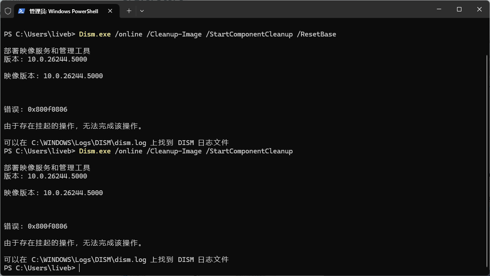

# 记录一次C盘清理

TreeSize 软件分析C盘：

​​

## ​`DriverStore`​

​`DriverStore`​是Windows用来存放第3方驱动程序的，当你安装一个驱动时，对应的文件就会被拷贝到DriverStore。当你卸载驱动时，文件会从DriverStore中删除。如果你升级驱动时，Windows会保留旧版驱动，这样有问题时可以回滚。

### 管理工具 **[DriverStoreExplorer](https://github.com/lostindark/DriverStoreExplorer)** 清理

管理员工具打开

​​

导备份到其他目录

​​

选取旧的驱动，删除即可。

结果：删除了2G多

​​

## `WinSxs`​

​​

WinSxS是Windows目录下一个**重要的目录**，相当于系统中必备的文件夹之一，里面包含Windows共享文件、备份和已禁用的功能文件以及缓存和临时数据文件等，**是不可以直接删除的，否则容易引起系统崩溃**！

### 使用Dism工具清理

```bash
Dism.exe /online /Cleanup-Image /StartComponentCleanup
或者
Dism.exe /online /Cleanup-Image /StartComponentCleanup /ResetBase
```

​​

有未完成的更新，更新后再执行

​​

## `windows.old`​

​​

Windows.old是微软子Win XP开始，修复、恢复系统或者升级安装系统，为了保留旧系统的文件，方便用户恢复旧系统，系统自动创建的系统文件夹，默认位于C盘中。它的作用是为了保留旧系统的文件，如果新系统有问题，用户可以提取它里面的文件来替换整个系统或单个文件。如果你不打算回退到以前版本，就可以删除它，腾出大量磁盘空间。另外，Windows会在升级30天后自动丢弃该文件夹，如果你希望提前删除它，请看下面操作。在操作之前，请您知晓删除Windows.old文件是无法撤销的，请务必备份重要文件。

这块win11系统给了两块功能，用于管理

### 存储感知功能：

​​

### 清理建议：

​​

## `hiberfil.sys`​

计算机内置休眠文件（hiberfil.sys），便于快速将系统从休眠状态中唤醒，但休眠文件一般保存在 C 盘中，会占用系统大量空间

 本文介绍了C盘中hiberfil.sys文件的用途，它是Windows休眠功能所必需的，占用空间与内存大小相当。休眠与睡眠的区别在于休眠会将所有内存数据写入硬盘，而睡眠则保存在内存中。由于休眠文件的体积大且影响磁盘碎片整理，对于不常用休眠功能的用户，可以删除此文件以释放空间。提供了通过命令行关闭和开启休眠功能的方法，以及创建批处理文件的简便操作。

### 管理员模式CMD执行 关闭休眠

```cmd
# 关闭休眠
POWERCFG -H OFF
```


​`POWERCFG -H ON`​ 打开休眠

‍

## AppData

​​

### 只有部分文件夹可以删除

AppData\\Local\\Temp、AppData\\Local\\Microsoft\\Windows\\Temporary Internet Files和AppData\\Local\\Microsoft\\Windows\\History里面的文件都可以删除，3个都是缓存或者临时文件存放的位置。

‍

## 总结：

到此为止，涉及Windows系统盘的清理就这些，其他的用户文件如文档、下载、`Program Files`​等文件夹自行处理，移动软件安装目录，浏览器下载目录、微信文件存储目录 也会处理一部分空间

清理完，记得删一下回收站！！！
